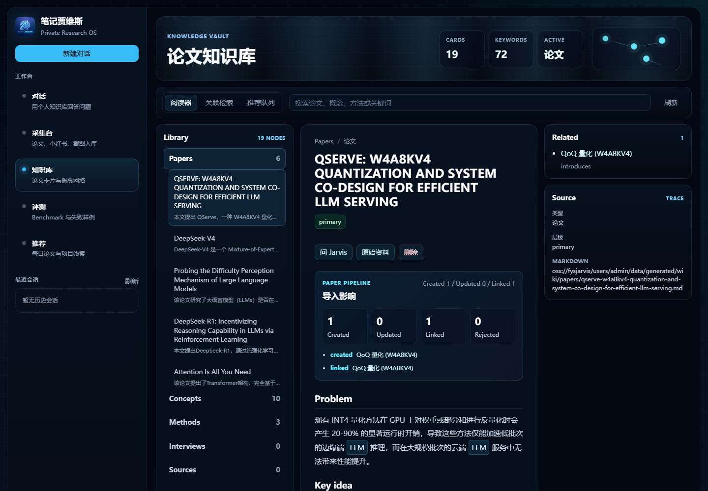
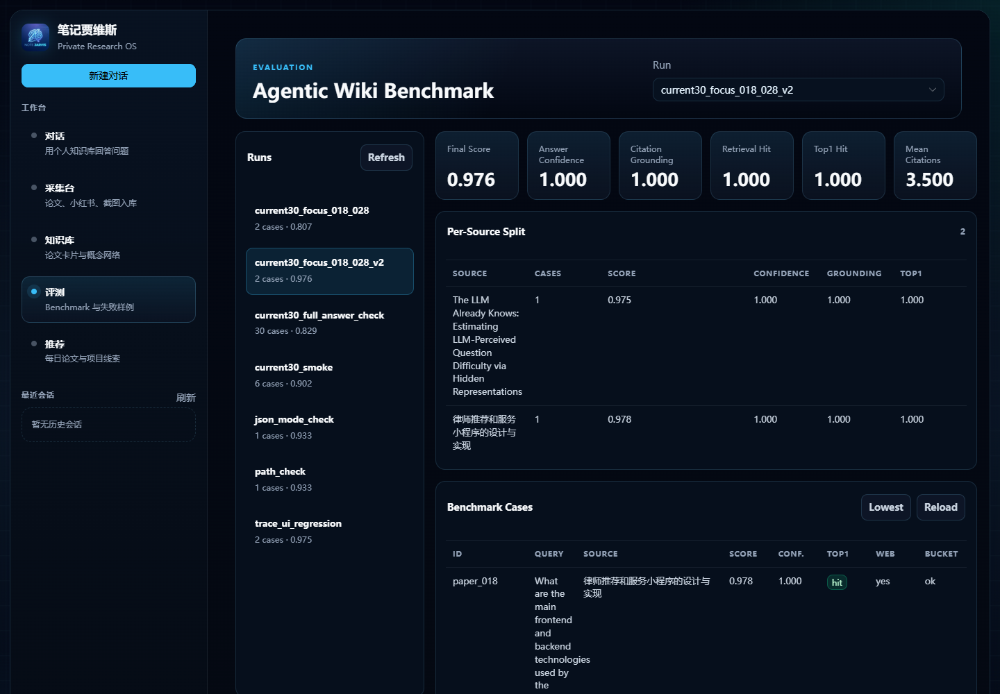

# LLM-WIKI

LLM-WIKI is a personal research knowledge system for reading papers, extracting
technical concepts, and answering questions with tool-using agents.

It is not a plain vector RAG demo. The core idea is to turn raw papers and
learning materials into a maintainable wiki graph: paper cards, concept cards,
method cards, source evidence, links, aliases, and evaluation traces.

## Demo

### Knowledge Vault

The knowledge vault shows imported papers, generated concept/method cards,
source links, keyword jumps, and the paper ingestion impact.



### Agent Evaluation

The evaluation dashboard tracks answer quality, confidence, citation grounding,
retrieval hit rate, Top1 hit rate, and per-case failures.



## What This Project Does

- Imports local PDFs through a paper ingestion pipeline.
- Parses papers with Docling remote service, with local parser fallback.
- Distills paper content into structured wiki cards.
- Reviews and merges extracted knowledge into an existing wiki graph.
- Builds `PaperPage`, `ConceptPage`, `MethodPage`, `InterviewQA`, and
  `SourceNote` cards.
- Stores durable source artifacts through OSS-backed object storage.
- Indexes wiki cards and raw sources for retrieval.
- Lets a Wiki Agent decide whether to use wiki search, card lookup, web search,
  or resource recommendation.
- Records tool traces and evaluates real answers with benchmark cases.

## Paper Ingestion Pipeline

```text
PDF
  -> Docling extraction
  -> information distillation
  -> reviewer validation
  -> merge planner
  -> wiki cards + links + aliases + chunks
  -> agentic search and grounded Q&A
```

The pipeline keeps raw source material and compiled wiki cards separate. This
makes the system easier to debug: the original paper is preserved, while the
wiki layer can be refined or rebuilt.

## Agent Tools

The Wiki Agent uses tools instead of relying on a single retrieval call:

- `wiki_search`: find relevant cards and chunks from the local wiki.
- `wiki_card`: open a specific card and inspect structured fields.
- `web_search`: supplement with external information when needed.
- `resource_recommend`: recommend follow-up learning resources.

The agent trace records which tools were selected, what evidence was retrieved,
and how the final answer was grounded.

## Architecture

```text
Vue + Naive UI Frontend
  - Capture Console
  - Knowledge Vault
  - Wiki Chat
  - Evaluation Dashboard
        |
        v
FastAPI Backend
        |
        v
Paper / Source Ingestion
  - Docling remote parser
  - fallback parser
  - raw source vault
  - OSS object storage
        |
        v
Wiki Layer
  - wiki_pages
  - wiki_chunks
  - wiki_aliases
  - wiki_card_links
  - source_packets
  - distilled_candidates
  - review_reports
        |
        v
Tool-Using Wiki Agent
  - tool planning
  - wiki search
  - card lookup
  - web search
  - answer synthesis
  - evaluation traces
```

## Current Demo Data

The demo knowledge base includes imported paper cards such as:

- `Attention Is All You Need`
- `DeepSeek-R1: Incentivizing Reasoning Capability in LLMs via Reinforcement Learning`
- `Probing the Difficulty Perception Mechanism of Large Language Models`
- `Does Reinforcement Learning Really Incentivize Reasoning Capacity in LLMs Beyond the Base Model?`
- `QServe: W4A8KV4 Quantization and System Co-Design for Efficient LLM Serving`
- `DeepSeek-V4`

The screenshot example shows 6 paper cards, 10 concept cards, 3 method cards,
and 72 keyword aliases.

## Quick Start

### 1. Install Python Dependencies

```bash
pip install -r requirements.txt
```

### 2. Configure Environment Variables

Create `.env` from the example file:

```powershell
Copy-Item .env.example .env
```

At minimum, configure the LLM provider key:

```env
SILICONFLOW_API_KEY=your-key
```

Optional Docling remote parser:

```env
DOCLING_MODE=remote
DOCLING_BASE_URL=http://127.0.0.1:5001
DOCLING_TIMEOUT_SECONDS=360
```

Optional OSS storage:

```env
STORAGE_BACKEND=oss
STORAGE_ROOT_PREFIX=users/admin
OSS_ENDPOINT=your-oss-endpoint
OSS_BUCKET=your-bucket
OSS_ACCESS_KEY_ID=your-access-key-id
OSS_ACCESS_KEY_SECRET=your-access-key-secret
```

Do not commit `.env`.

### 3. Start Docling

```powershell
docker compose -f .\docker-compose.docling.yml up -d
```

If Docling is unavailable, set:

```env
DOCLING_MODE=off
```

The system will use the fallback parser.

### 4. Start Backend

```bash
python -m uvicorn backend.app:app --host 127.0.0.1 --port 8000
```

Backend URL:

```text
http://127.0.0.1:8000
```

### 5. Start Frontend

```bash
cd frontend
npm install
npm run dev
```

Frontend URL:

```text
http://127.0.0.1:5173
```

## Import a Local Paper

Put PDFs under `data/`, then import through the capture UI or call the API:

```bash
curl -X POST http://127.0.0.1:8000/api/wiki/ingest \
  -F "local_path=data/attention is all you need.pdf" \
  -F "pipeline=four_agent" \
  -F "source_url="
```

Check ingestion jobs:

```bash
curl http://127.0.0.1:8000/api/wiki/ingest/jobs?limit=20
```

## Evaluation

Run the agentic wiki benchmark:

```bash
python test/evaluation/scripts/run_agentic_wiki_eval.py \
  --dataset test/evaluation/datasets/wiki_chat/current_papers_30.csv \
  --output-dir test/evaluation/runs/current30_run
```

The evaluation dashboard reads run artifacts from:

```text
test/evaluation/runs/
```

## Repository Hygiene

The repository excludes private and generated runtime artifacts:

- `.env`
- local SQLite databases
- local logs
- uploaded PDFs
- generated raw sources
- frontend build output
- Python caches

Use `.env.example` for configuration and keep credentials out of GitHub.
