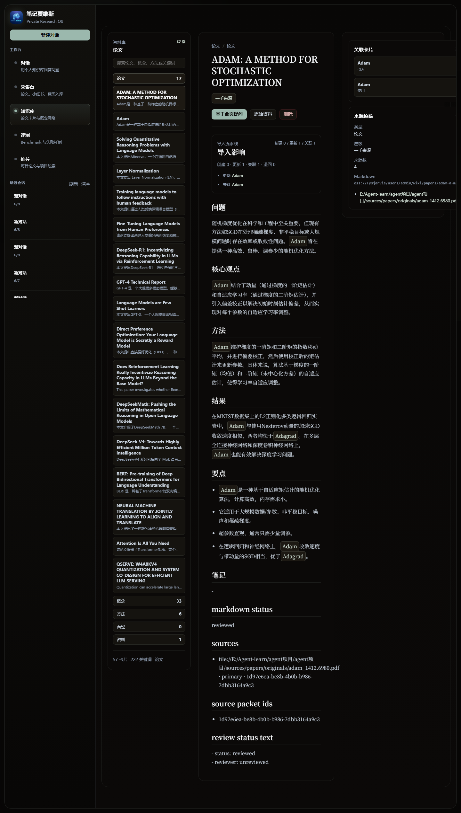
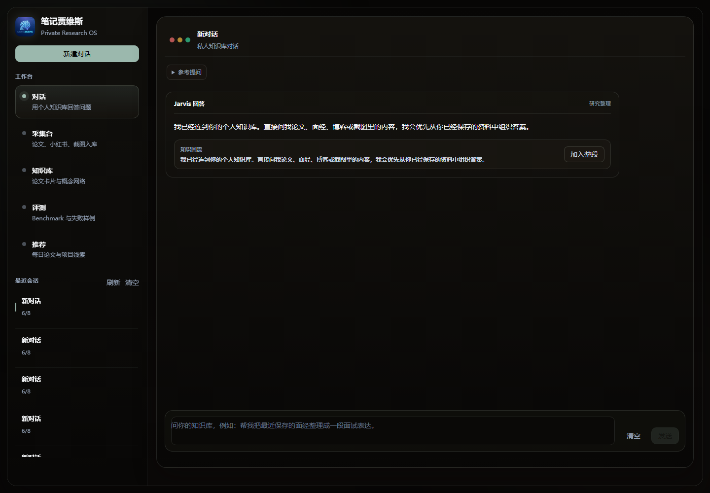

# 面向论文阅读的 LLM Wiki Agent 系统

这是一个面向论文学习、技术概念沉淀和知识库问答的个人 LLM Wiki 系统。项目的目标不是做一个普通的“PDF 分块 + 向量检索 + 问答”RAG Demo，而是把论文和学习资料编译成可维护、可追踪、可持续演进的 Markdown Wiki。

系统围绕三件事展开：

- 用四阶段 pipeline 把论文从原始 PDF 编译成 `PaperPage / ConceptPage / MethodPage`。
- 用 Markdown-first 架构保存知识主产物，SQLite 只作为前端、检索、图谱和 chunk 的缓存索引。
- 用类 Claude Code 的 Tool-Use Agent 查询私有 Wiki、展开证据、必要时使用 Web Search / Web Fetch 补充外部信息。

## 效果展示

### 知识库界面

知识库界面展示论文卡片、概念卡片、方法卡片、关键词跳转、来源追踪、Markdown 路径和入库影响。



### Wiki Agent 对话界面

对话界面通过 Wiki Agent 使用私有知识库回答问题，并支持将有价值的回答片段回流到个人知识库。



## 核心能力

- **论文异步入库**：支持 PDF 上传、后台任务执行和入库状态追踪。
- **Docling 解析**：优先使用 Docling remote parser 解析论文结构，失败时可回退到本地解析。
- **OSS 原文存储**：原始 PDF、raw source、wiki markdown、query artifact 按 `users/admin/sources / wiki / queries` 组织。
- **四阶段知识处理链路**：`Extraction -> Distillation -> Review -> Merge`，把论文沉淀为结构化 Wiki Graph。
- **Markdown-first Wiki**：Markdown 是知识主产物；SQLite 中的 `wiki_pages / aliases / links / sources / chunks` 是可重建缓存。
- **Tool-Use Wiki Agent**：基于 OpenAI-compatible `tools / tool_choice` 实现原生 function calling，支持 `wiki_search / wiki_card / web_search / web_fetch / resource_recommend`。
- **证据约束回答**：回答优先引用私有 Wiki 和 source evidence，必要时使用外部网页证据补充。
- **评测闭环**：构建 30 题 benchmark 和 LLM-as-Judge 流程，用于评估检索命中、引用可靠性和回答质量。

## 技术栈

| 模块 | 技术 |
| --- | --- |
| 前端 | Vue 3, Vite, Naive UI |
| 后端 | FastAPI, SQLite |
| 论文解析 | Docling remote parser, fallback parser |
| LLM 接入 | SiliconFlow OpenAI-compatible Chat Completions |
| 知识存储 | Markdown Wiki, SQLite index/cache, OSS object storage |
| Agent 工具 | native tools/function calling + JSON routing fallback |
| 评测 | 30 题 benchmark, LLM-as-Judge, answer confidence review |

## 系统架构

```text
PDF / Paper Source
        |
        v
Docling Extraction Agent
        |
        v
Distillation Agent
        |
        v
Reviewer Agent
        |
        v
Merge Planner Agent
        |
        v
Markdown-first Wiki
  - PaperPage
  - ConceptPage
  - MethodPage
  - Source Evidence
  - Links / Aliases
        |
        v
SQLite Index / Cache
  - wiki_pages
  - wiki_chunks
  - wiki_aliases
  - wiki_card_links
  - wiki_card_sources
        |
        v
Wiki Agent
  - wiki_search
  - wiki_card
  - web_search
  - web_fetch
  - resource_recommend
        |
        v
Evidence-grounded Answer
```

## 四阶段论文入库流程

```text
PDF
  -> Extraction: Docling 解析 PDF，保存 raw source 和 source packet
  -> Distillation: LLM 蒸馏 Paper / Concept / Method 候选卡片
  -> Review: Reviewer 检查 schema、证据质量和重复候选
  -> Merge: Merge Planner 决定 create / update / link / skip
  -> Markdown: 写入 canonical Markdown Wiki
  -> Reindex: 从 Markdown 重建 SQLite 索引和 chunks
```

这条链路的重点是：论文不是被简单切成 chunk，而是被编译成可维护的 Wiki 页面。后续导入新论文时，系统会尝试把新概念、新方法和已有卡片融合，而不是每篇论文孤立存放。

## Markdown-first 设计

项目已经从 DB-first 演进为 Markdown-first：

- `wiki/*.md` 是知识主产物，适合阅读、diff、审查和长期维护。
- SQLite 是查询缓存，服务于前端、检索、图谱、chunk index 和评测。
- 手动修改 Markdown 后，可以通过 reindex 同步回 SQLite。
- merge 主路径写 Markdown，再由 parser/reindexer 回填 SQLite。

这让系统更接近 Karpathy 提到的 LLM-maintained Wiki：LLM 负责维护 Wiki，人主要阅读、审查和追问。

## Wiki Agent 工具调用

系统参考 Claude Code 的 Tool-Use Agent 范式，但工具执行由本项目后端完成。

当前工具包括：

- `wiki_search`：搜索私有 Wiki 的 chunks 和 cards。
- `wiki_card`：展开具体 Wiki 卡片，读取结构化字段、来源和关联卡片。
- `web_search`：搜索外部网页，补充最新信息或资料来源。
- `web_fetch`：打开具体 URL，抽取可引用网页内容。
- `resource_recommend`：推荐后续论文、教程、视频和学习资源。

实现上优先使用 SiliconFlow OpenAI-compatible `tools / tool_choice` 原生 function calling；如果模型或接口异常，会回退到 prompt-driven JSON tool routing，保证工具链路可用。

## 当前评测结果

基于 30 题 Wiki QA benchmark 的一次完整评测：

| 指标 | 结果 |
| --- | --- |
| 检索命中率 | 100% |
| Top1 命中率 | 76.67% |
| 引用可靠性 | 100% |
| 回答置信度 | 86.32% |

评测不仅看“有没有检索到”，也看最终答案是否全面、是否贴合原文贡献、是否有可靠引用。

## 目录说明

```text
backend/                  FastAPI API 层
frontend/                 Vue 前端
system/wiki/              Wiki 存储、入库、Agent、Markdown reindex
system/document/          PDF / Docling 解析
system/storage/           OSS 与本地缓存布局
system/search/            Web Search / Web Fetch / Resource Recommend
scripts/                  重建、入库、reindex 工具脚本
test/evaluation/          Wiki QA benchmark 与评测结果
image/                    README 展示截图
```

运行时数据建议通过 `.gitignore` 排除，不要把 `.env`、数据库、日志、原始论文和 OSS 缓存提交到仓库。

## 快速启动

### 1. 安装后端依赖

```bash
pip install -r requirements.txt
```

### 2. 配置环境变量

创建 `.env`，至少配置 LLM Key：

```env
SILICONFLOW_API_KEY=your-key
SILICONFLOW_SUMMARY_MODEL=deepseek-ai/DeepSeek-V4-Flash
SILICONFLOW_REVIEW_MODEL=Qwen/Qwen3.6-27B
SILICONFLOW_MERGE_MODEL=Qwen/Qwen3.6-27B
```

如果使用 Docling remote parser：

```env
DOCLING_MODE=remote
DOCLING_BASE_URL=http://127.0.0.1:5001
DOCLING_TIMEOUT_SECONDS=360
```

如果使用 OSS：

```env
STORAGE_BACKEND=oss
STORAGE_ROOT_PREFIX=users/admin
OSS_ENDPOINT=your-endpoint
OSS_BUCKET=your-bucket
OSS_ACCESS_KEY_ID=your-access-key-id
OSS_ACCESS_KEY_SECRET=your-access-key-secret
```

### 3. 启动 Docling

```powershell
docker compose -f .\docker-compose.docling.yml up -d
```

如果没有 Docling，也可以设置：

```env
DOCLING_MODE=off
```

### 4. 启动后端

```bash
python -m uvicorn backend.app:app --host 127.0.0.1 --port 8000
```

后端地址：

```text
http://127.0.0.1:8000
```

### 5. 启动前端

```bash
cd frontend
npm install
npm run dev
```

前端地址：

```text
http://127.0.0.1:5173
```

## 批量入库论文

将论文 PDF 放在：

```text
sources/papers/originals/
```

运行小批量入库：

```bash
python scripts/ingest_paper_corpus.py --limit 3 --no-maintenance
```

跳过已入库论文：

```bash
python scripts/ingest_paper_corpus.py --skip-existing --limit 3 --no-maintenance
```

## 从 Markdown 重建索引

单独 reindex 指定 Markdown：

```bash
python scripts/reindex_wiki_markdown.py wiki/papers/example.md
```

扫描本地 Wiki：

```bash
python scripts/reindex_wiki_markdown.py --wiki-dir wiki
```

扫描 OSS / local storage prefix：

```bash
python scripts/reindex_wiki_markdown.py --oss-prefix users/admin/wiki --limit 100
```

## 运行评测

```bash
python test/evaluation/scripts/run_agentic_wiki_eval.py \
  --dataset test/evaluation/datasets/wiki_chat/current_papers_30.csv \
  --output-dir test/evaluation/runs/current30_run
```

评测结果会写入：

```text
test/evaluation/runs/
```

## 项目定位

这个项目更适合被理解为：

> 面向论文学习的 Markdown-first LLM Wiki Agent，而不是普通 RAG 问答系统。

它的核心价值在于把论文阅读过程沉淀成可维护的 Wiki Graph：原始资料可追溯，知识卡片可编辑，SQLite 索引可重建，Agent 查询过程可观测，评测结果可量化。
