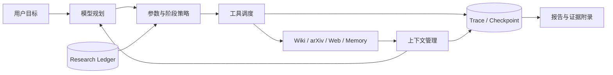

# PaperWiki：面向论文知识演进的 Research Agent

> 将论文持续编译成可检索、可核验、可更新的 Markdown Wiki，并让长时间研究任务能够被中断、恢复和审计。

PaperWiki 不是“上传 PDF 后问一次问题”的普通 RAG。它主要解决两个工程问题：

1. **新论文如何安全修改已有知识**：结论必须绑定原文证据；普通补充自动合并，矛盾、替代和证据异常进入人工审批。
2. **长任务如何不依赖模型记忆维持进度**：研究目标、语料覆盖、已读页面、剩余条件和交付物状态持久化在 Runtime 中，即使上下文压缩或服务重启也能继续。


## 项目贡献

### 1. Evidence-aware Knowledge Compiler

论文不会被直接切块后丢进向量库，而是经过“解析—提炼—回读—核验—合并”流程，编译成可维护的论文页和主题页。

```text
PDF / arXiv URL
  -> arXiv HTML / MinerU / PyMuPDF 解析路由
  -> 编译 paper-wiki-v2 论文页
  -> Claim 绑定稳定 Evidence ID
  -> Verifier 回读来源判断证据是否支持 Claim
  -> 召回同一对象、方面和适用条件下的旧结论
  -> 生成 Markdown Revision
  -> 普通新增自动提交 / 冲突与替代进入人工审批
  -> 重建检索索引
```

- **模型负责语义判断**：提炼 Claim、判断证据蕴含关系、识别新旧结论的补充或冲突关系。
- **Python 负责确定性约束**：状态迁移、Evidence ID 存在性、数字一致性、候选范围、幂等提交、版本 diff 与 rollback。
- **表格不经过模型转录**：模型只选择 `table_id`，Python 将解析结果中的 Markdown 表格原样回填到 Wiki Card。
- **图表不猜像素内容**：只根据图注、脚注和相邻正文生成 Figure Notes；来源没有说明的趋势不会补写。

这条边界的目的不是证明小模型能发现整个知识库里的所有矛盾，而是先用检索缩小候选范围，再让模型处理少量语义关系，最后由程序控制写入副作用。

### 2. 可控、可恢复的 Agent Runtime

PaperWiki 使用单 Agent 的动态 `plan -> call -> observe` 循环。模型可以提出行动，Runtime 决定这些行动能否、何时以及以什么顺序执行。


```mermaid
flowchart LR
    U[用户目标] --> P[模型规划]
    P --> G[参数与阶段策略]
    G --> S[工具调度]
    S --> T[Wiki / arXiv / Web / Memory]
    T --> C[上下文管理]
    C --> P

    L[(Research Ledger)] --> G
    S --> R[(Trace / Checkpoint)]
    C --> R
    R --> O[报告与证据附录]
```

- 同一步中的独立只读工具最多 3 路并发，Observation 仍按模型最初的调用顺序归并。
- `wiki_search -> wiki_open`、`web_search -> web_fetch` 等存在数据依赖的调用保持顺序。
- `project_memory_update`、`arxiv_import_paper` 等写操作串行执行。
- 论文入库任务通过状态机、checkpoint、worker lease、heartbeat、恢复扫描和幂等提交处理重启与重复执行。
- 长研究任务使用结构化 Research Ledger 保存阶段、目标论文数、类别覆盖、已选择论文、入库任务、已读 Card、剩余条件和预算；模型上下文不是任务真相。

论文入库状态：

```text
QUEUED -> EXTRACTING -> DISTILLING -> VERIFYING
       -> COMPILING_PROPOSAL -> AWAITING_APPROVAL（仅高风险）
       -> COMMITTING -> REINDEXING -> COMPLETED
```

长研究任务状态：

```text
DISCOVER -> WAIT_INGEST -> VERIFY_CORPUS
         -> READ_LOCAL_CORPUS -> SYNTHESIZE -> COMPLETE
```

### 3. 知识、记忆、会话与上下文分层

| 层 | 保存内容 | 进入模型的方式 |
| --- | --- | --- |
| Markdown Wiki | 论文事实、方法、实验、表格、来源证据 | FTS5 与向量混合检索后按页读取 |
| 项目记忆 | 当前项目目标、约束、决定、进度、失败经验 | 新会话固定读取 `purpose.md` 与 `MEMORY.md` |
| 用户偏好 | 用户明确保存的长期偏好 | 少量固定注入 |
| SQLite 会话 | 原始消息、工具结果、Compact 摘要、检查点 | 按 Token 预算组装本轮上下文 |
| Research Ledger | 长任务阶段、覆盖情况、剩余要求、预算 | Runtime 判断任务是否真的完成 |

项目记忆采用 Coding Agent Notes 式的轻量文件，而不是为个人项目额外部署向量数据库：

```text
.paperwiki/memory/
├── preferences.md
└── projects/<project-id>/
    ├── purpose.md
    └── MEMORY.md
```

Agent 在工具循环中更新完整的 `MEMORY.md`；Python 只允许写入当前项目的固定路径，并执行大小限制和原子替换。论文知识仍然写入 Wiki，原始对话仍然写入 SQLite，三者不会混用。

上下文按 Token 预算管理。预算充足时保留有效历史；接近阈值时先回收旧工具输出，再压缩早期对话并保留最近原文。单条工具结果超过 50 KB 时，完整结果保存在 SQLite，当前 Prompt 只放头尾预览和 `result_id`；Agent 可以通过 `read_tool_result` 分页恢复原文。Compact 保存的是派生摘要和覆盖边界，不删除原始消息。

## 一次实际研究会发生什么

以“从 30 篇 Agentic RL 论文中寻找一个值得继续验证的方向”为例：

```text
用户提出研究目标
  -> Runtime 创建 Research Ledger
  -> Agent 搜索或导入论文
  -> 入库 Runtime 解析、核验并编译 Wiki Card
  -> Ledger 检查论文数量与主题覆盖
  -> Agent 分页读取本地 Corpus，而不是反复搜索同几篇论文
  -> 上下文接近预算时回收工具结果并 Compact 旧对话
  -> Ledger 继续保存已读页面与剩余要求
  -> Agent 生成读者报告与证据附录
  -> Runtime 根据 Ledger 判断是否真正完成
```

如果此时新开会话，原聊天内容不会整段注入；新会话会读取同项目的 `purpose.md` 和 `MEMORY.md`。用户继续长研究任务时，Runtime 会重新关联同项目未完成的 Ledger，再按需检索 Wiki。服务重启后，论文任务和研究进度也从持久化状态恢复。

## 检索与问答

Wiki 在 Markdown 小节上并行执行 SQLite FTS5 与 Qwen3-Embedding-0.6B 跨语言语义召回，再通过 RRF 融合。Agent 根据问题按需展开完整页面，并在本地资料不足或用户明确要求最新信息时访问 Web。

这与传统 RAG 的关系是：**混合检索仍然是取证手段，Wiki Compiler 和 Runtime 负责知识如何产生、如何更新以及长任务如何可靠执行。**

## 评测与验证

| 验证项 | 当前结果 | 说明 |
| --- | ---: | --- |
| Wiki Chat 30 题检索命中率 | 100% | 冻结回归集 |
| Wiki Chat Top-1 命中率 | 76.67% | 冻结回归集 |
| Wiki Chat 引用可靠性 | 100% | 30 题答案复核 |
| Wiki Chat 通过率 | 83.33% | 当前保留基线 |
| Verifier 门禁准确率 | 93.57% | 140 条、独立模型裁决的 Silver Set |
| 自动化测试 | 183 passed | 后端完整测试 |
| 前端验证 | 通过 | `vue-tsc -b && vite build` |

Verifier 数据集没有人工 Gold 标注，因此 93.57% 只能表述为 Silver Benchmark 结果。三个长任务在 Runtime 重构后尚未重新执行高成本端到端实验，README 不把重构前失败的结果包装成改造后指标。

## 为什么没有使用 Multi-Agent / LangGraph / Redis

- 当前论文研究链路共享同一知识状态。多 Agent 会增加上下文复制、协调冲突与模型费用，尚无独立到值得隔离的角色。
- 当前动态循环和持久化状态机已经能表达任务依赖；迁移到 LangGraph 不会自动提高正确率或恢复能力。
- 项目面向单用户本地运行，SQLite 同时承担会话、索引、状态和审计存储。多实例部署时才需要迁移任务传输层与向量索引。

这些是当前规模下的工程取舍，不是对其他架构的否定。

## 技术栈

| 层 | 实现 |
| --- | --- |
| 前端 | Vue 3、TypeScript、Vite、Naive UI |
| API | FastAPI、Pydantic |
| Agent Runtime | Python、SQLite 状态机、checkpoint、lease、heartbeat、trace |
| 文档解析 | arXiv HTML、MinerU VLM API、PyMuPDF fallback |
| 模型 | DeepSeek V4 Flash、Qwen 系列模型、Qwen3-Embedding-0.6B |
| 检索 | SQLite FTS5、向量召回、RRF |
| 知识主体 | Markdown Wiki + Evidence Ledger |
| 存储 | 本地文件系统 / 阿里云 OSS 租户前缀 |
| 工具接入 | Function Calling、MCP Python SDK |

## 快速启动

需要 Python 3.10+ 和 Node.js/npm。

```powershell
python -m pip install -r requirements.txt
python -m pip install --no-deps -e .
Copy-Item .env.example .env
```

在 `.env` 中至少配置模型与解析服务密钥，然后运行：

```powershell
paperwiki web
```

程序会构建前端、启动 FastAPI，并打开 `http://127.0.0.1:8000`。前端页面与 API 由同一个本地进程提供；按 `Ctrl+C` 停止。

常用参数：

```powershell
paperwiki web --build
paperwiki web --port 8001
paperwiki web --no-browser
```

开发模式：

```powershell
python -m uvicorn backend.app:app --host 127.0.0.1 --port 8000
cd frontend
npm run dev
```

## 建议演示路径

1. 导入一篇包含实验表格的 arXiv 论文，展示解析、Claim 核验和 Markdown Card。
2. 用中文询问英文论文，展示 `wiki_search -> wiki_open`、混合检索和引用回答。
3. 导入与已有结论冲突的论文，在 Review Center 查看双方证据和 Markdown diff。
4. 启动论文入库后中断服务，重启并展示从 checkpoint 恢复。
5. 输入 `/compact` 后继续追问，说明摘要没有删除 SQLite 中的原始消息。
6. 新建会话，继续同一研究项目，展示 `purpose.md`、`MEMORY.md` 和 Research Ledger 的分工。

## 目录

```text
backend/                  FastAPI、CLI 与审批接口
frontend/                 Vue 3 研究工作台
mcp_servers/              arXiv MCP Server
system/agent_runtime/     任务状态、Research Ledger、Trace 与恢复
system/document/          HTML / MinerU / PyMuPDF 解析路由
system/wiki/              检索、核验、知识编译与版本管理
system/conversation/      会话、Token 预算、工具结果与 Compact 检查点
system/memory/            用户偏好与项目记忆
test/evaluation/          冻结数据集、基线结果与 Agent 评测脚本
docs/                     设计、配置和评测细节
```

## 已知边界

- 冲突发现依赖候选召回与模型判断，尚不能宣称解决开放域通用矛盾检测。
- Figure Notes 当前基于图注和邻近正文，文本模型不直接读取图片像素。
- Research Ledger 当前针对三个明确的长研究协议，不是任意任务的通用工作流引擎。
- 问答可以恢复消息、工具结果与 Compact 检查点，但不会恢复模型中断瞬间的隐藏推理栈。
- 当前存储与执行器面向单用户本地运行；大规模多用户部署需要替换向量索引和任务传输层。

## 核心设计原则

> 模型负责提出语义决策，程序负责验证边界、保存真实状态并控制副作用。
