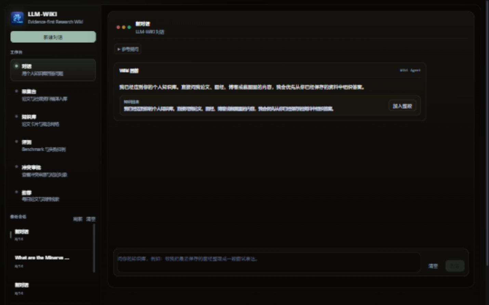
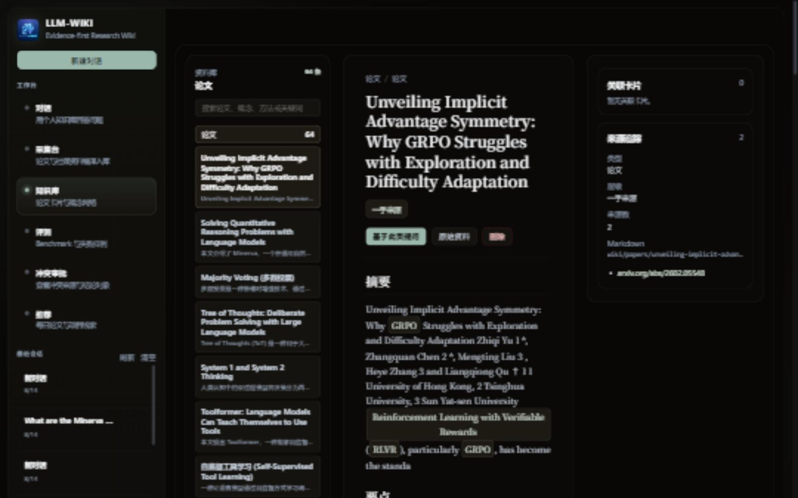

# PaperWiki（LLM-WIKI）

> 把论文和研究对话持续编译成可检索、可核验、可更新的个人 Markdown Wiki。

PaperWiki 是一个基于 Python 和 Vue 的论文知识库与研究问答应用。系统维护一份可持续更新的 Wiki：新论文进入后会提炼论文页和主题页，判断它是在补充已有知识，还是与旧结论发生冲突；普通新增自动提交，高风险修改才进入审批。用户问问题时，Agent 自己决定搜索 Wiki、展开页面、查询表格，还是在内部资料不足时访问网页。





## 两条 Agent 工作流

### 论文入库与知识维护

```text
PDF / arXiv URL
  -> 结构解析
  -> 提炼论文结论和主题
  -> 回读来源核验
  -> 与已有 Wiki 合并
  -> 生成 Markdown 修订版本
  -> 低风险自动提交 / 高风险冲突审批
  -> 重建检索索引
```

解析不再依赖 Docker 服务：

- arXiv 论文优先读取官方结构化 HTML，完整性检查通过后直接使用，通常只需秒级网络和本地转换时间。
- HTML 缺失或结构不完整、普通用户上传、扫描件会调用 MinerU 精准解析 API。
- 两条精确路径都失败时才使用 PyMuPDF 文本降级，并在任务中明确标记 `degraded` 和失败原因。
- 页码和 bbox 是可选定位信息，不参与普通检索，也不会进入 Wiki 正文或模型上下文。
- MinerU 的结果包只在内存中读取 Markdown 和表格，不在项目目录堆积 zip、截图和中间图片。

系统保存稳定的 evidence ID，把提炼出的结论绑定到实际段落或表格单元格。合并时只有“同一对象、同一方面、适用条件重叠”的新旧结论才进入关系判断，避免仅因关键词相似就制造冲突。

### 面向用户的研究问答

```text
用户问题
  -> Agent 判断需要什么信息
  -> Wiki 小节混合检索
  -> 按需展开 2～5 个页面
  -> 精确数字问题才查询结构化表格
  -> 本地资料不足或问题要求最新信息时才访问网页
  -> 带引用回答
```

Wiki 检索在页面小节上并行执行 FTS5 关键词召回与 Qwen3-Embedding-0.6B 多语言语义召回，再用 RRF 融合。没有额外 Reranker；最终页面选择交给工具调用 Agent。聊天控制器与最终回答使用 DeepSeek 官方 `deepseek-v4-flash`，论文提炼、核验和合并模型可分别配置。

前端展示实际发生的搜索、页面读取、表格查询和网页访问，不展示模型私有思维链。

## 为什么它是 Agent 项目

项目的重点不在“调用了几个模型”，而在模型决策与工程控制的边界：

- 模型决定调用哪个工具、提炼哪些结论，以及新旧知识之间的语义关系。
- Python 负责状态迁移、证据存在性和数字一致性检查、文件写入、幂等提交与回滚。
- 每次论文任务和问答都有 Agent Run，模型调用、工具调用、耗时、Token、错误和重试进入统一 Trace。
- 论文任务使用 checkpoint、lease、heartbeat 和恢复扫描；服务中断后从已保存状态和不可变来源安全重放。
- 问答支持停止、运行中补充要求和排队追问，但不为无不可逆副作用的聊天增加论文任务级 checkpoint 成本。

论文任务状态：

```text
QUEUED -> EXTRACTING -> DISTILLING -> VERIFYING
       -> COMPILING_PROPOSAL -> AWAITING_APPROVAL（仅高风险）
       -> COMMITTING -> REINDEXING -> COMPLETED
```

## 知识库、项目记忆、用户记忆与会话上下文

四类数据各自维护。所有旧会话和新会话都会自动绑定当前默认研究项目，因此新建对话不会丢失同项目的目标、约束、决定和未解决问题：

| 类型 | 内容 | 使用方式 |
| --- | --- | --- |
| Wiki 知识库 | Markdown 论文页、主题页及来源证据 | 按问题检索和引用 |
| 项目记忆 | 项目目标、研究状态、约束、决定、里程碑和开放问题 | 同项目跨会话自动加载或按需召回 |
| 用户记忆 | 明确的持续偏好及其原文证据、来源会话和置信度 | 跨项目少量注入或按需召回 |
| 会话记录与上下文 | 原始消息、工具观察、压缩摘要 | 构建本次模型请求，支持历史找回 |

工具规划和最终回答共享有效历史。预算允许时保留全部有效对话；完整请求接近阈值时，先缩减工具观察，再总结早期历史并保留近期原文。

- DeepSeek V4 Flash 默认按 **1M Token** 窗口配置，另可设置应用运行预算。默认约在窗口的 80% 触发整理。
- 摘要与覆盖边界原子提交到 SQLite 检查点；原始消息仍保留，模型可调用历史搜索、原文读取和工具记录读取工具。
- DeepSeek V4 Flash 自动把多轮追问改写为独立检索问题，并在回答完成后提取结构化会话状态、项目状态和长期记忆候选；Python 校验证据、作用域、置信度、去重和 TTL 后提交。
- `/purpose` 查看项目目标；`/purpose <自然语言要求>` 结合当前会话更新目标；`/purpose 清除` 清空项目目标。普通对话仍会自动维护项目状态和记忆。
- `/compact` 手动整理会话；普通聊天和自动压缩不会写入 Wiki。
- `/wiki <沉淀要求>` 将用户指定的讨论沉淀到知识库，保留论文事实、AI 综合和用户洞见的来源区别。
- 删除会话会同步删除消息、压缩检查点和工具观察；用户记忆与 Wiki 独立管理。
- 默认 Token 数是带余量的估算，支持配置模型匹配的本地 tokenizer。聊天页面可展开查看请求用量。

## 冲突审批与版本安全

新页面、普通补充和证据加强自动提交。只有以下情况进入 Review Center：

- 新结论与已有结论在同一对象、同一方面和相同适用条件下矛盾；
- 新来源明确替代旧结论；
- 证据核验异常或提交前状态已过期。

审批页展示冲突来源、冲突对象、系统建议和最终会造成的 Markdown 变化。正式页面、来源关系和别名在批准前都不改变。提交使用 `pending -> accepted -> committing -> approved`，失败进入可重试的 `commit_failed`；所有修订都可 diff 和 rollback。

## arXiv MCP

独立 MCP Server 提供：

- `arxiv_search`：按主题、作者、分类和年份搜索；
- `arxiv_get_paper`：读取论文元数据；
- `arxiv_download_pdf`：校验并缓存用户选中的 PDF；
- `arxiv_import_paper`：提交到同一论文入库 Runtime；
- `arxiv_ingestion_status`：查询异步进度。

MCP 不复制入库逻辑。它只负责文献发现与提交，去重、解析路由、核验、合并、审批和恢复仍由 FastAPI 后端统一管理。详见 [arXiv MCP](docs/design/ARXIV_MCP.md)。

## 当前评测

30 题 Wiki 问答回归：

| 指标 | 结果 |
| --- | ---: |
| 检索命中率 | 100% |
| Top-1 命中率 | 76.67% |
| 引用可靠性 | 100% |
| 回答置信度 | 86.32% |
| 综合分 | 82.87% |

240 条零人工 silver benchmark：

| 子任务 | 结果 |
| --- | ---: |
| Verifier 准确率 | 93.57% |
| Table Resolver 召回率 | 94% |
| Table QA 端到端通过率 | 76% |
| 精确单元格问答 | 88.33% |

这些数字用于工程回归，不是人工 gold benchmark。240 条测试由 140 条 evidence 关系判断与 100 条表格问题组成；详细口径见 [评测说明](docs/audits/EVIDENCE_WIKI_SILVER_BENCHMARK_2026-08-13.md)。

在一篇 24 页 arXiv 论文的本地对照实验中，结构化 HTML 下载与转换约 2.84 秒，MinerU VLM 从提交到结果文件约 134.60 秒。它只说明解析路由能减少具备完整 HTML 论文的等待时间，不是跨数据集准确率结论。

## 技术栈

| 层 | 实现 |
| --- | --- |
| 前端 | Vue 3、TypeScript、Vite、Naive UI |
| API | FastAPI、Pydantic |
| Agent Runtime | SQLite 状态机、checkpoint、lease、heartbeat、trace |
| 任务执行 | 有界 worker pool、持久化排队、恢复扫描 |
| 文档解析 | arXiv LaTeXML HTML、MinerU VLM API、PyMuPDF fallback |
| LLM | DeepSeek 官方 Chat Completions + SiliconFlow 模型分工 |
| 知识主体 | Markdown Wiki |
| 检索 | SQLite FTS5、Qwen3-Embedding-0.6B、RRF |
| 表格 | 结构化 cell、Pandas、只读 DuckDB |
| 存储 | 本地文件系统 / 阿里云 OSS 租户前缀 |
| MCP | MCP Python SDK，stdio / Streamable HTTP |

## 快速启动

### 1. 安装

```powershell
python -m pip install -r requirements.txt
python -m pip install --no-deps -e .
```

### 2. 配置

```powershell
if (!(Test-Path .env)) { Copy-Item .env.example .env }
```

至少填写：

```env
DEEPSEEK_API_KEY=your-deepseek-key
SILICONFLOW_API_KEY=your-siliconflow-key
MINERU_API_TOKEN=your-mineru-token

PAPER_PARSER_MODE=auto
DEEPSEEK_CHAT_MODEL=deepseek-v4-flash
WIKI_VECTOR_SEARCH_ENABLED=true

STORAGE_BACKEND=local
STORAGE_TENANT_ID=local-user
STORAGE_ROOT_PREFIX=users/local-user
```

`MINERU_API_TOKEN` 未配置时，arXiv HTML 仍可用；普通 PDF 会明确降级到 PyMuPDF。

### 3. 一条命令启动

安装后，在任意 PowerShell 目录运行：

```powershell
paperwiki web
```

服务就绪后自动打开 `http://127.0.0.1:8000`。Vue 页面和 API 由同一个 FastAPI 进程提供，保留当前项目的 `.env`、`sessions.db` 和知识库；终端保持运行，按 `Ctrl+C` 停止。无需 Docker Desktop。

首次运行会自动安装前端依赖并构建（需要 Node.js/npm）；已有构建且源码未更新时直接启动。检测到前端文件更新会自动重新构建，不需要另开 Vite。也可手动强制构建：

```powershell
paperwiki web --build
```

可选参数：`paperwiki web --port 8001` 更换端口；`paperwiki web --no-browser` 只启动服务。端口被占用时会提示，不会停止其他程序。

这里的 `pip install -e .` 只把本地源码目录注册为 Python 命令，没有发布 npm 或 PyPI 包。不要删除或移动项目目录；移动后在新目录重新安装。若 PowerShell 找不到命令，将当前 Python 的 Scripts 目录加入用户 PATH 并重开终端；也可在项目根目录运行 `python -m backend.cli web`。

### 开发模式（前端热更新）

需要实时修改页面时，仍可分开启动：

```powershell
python -m uvicorn backend.app:app --host 127.0.0.1 --port 8000
```

另开终端：

```powershell
cd frontend
npm run dev
```

- Web：`http://127.0.0.1:5173`
- API：`http://127.0.0.1:8000`
- Health：`http://127.0.0.1:8000/api/health`

### 4. 启动 arXiv MCP（可选）

```powershell
python -m mcp_servers.arxiv_server
```

或使用 Streamable HTTP：

```powershell
python -m mcp_servers.arxiv_server --transport streamable-http --host 127.0.0.1 --port 8011
```

## 使用示例

1. 用中文询问英文论文主题，观察 `wiki_search -> wiki_open` 的真实工具过程。
2. 追问精确数值，展示 Agent 按需调用 `table_query`，而不是默认扫描全部表格。
3. 输入 `/purpose 把当前项目聚焦到无需定制 CUDA kernel 的推理优化`，新建对话后继续追问项目目标。
4. 讨论后输入 `/wiki 把刚才形成的设计判断沉淀成我的洞见`，在知识库查看新页面。
5. 输入 `/compact`，继续追问并说明摘要只改变后续上下文，不删除原消息。
6. 在冲突审批页展示新旧结论、各自来源和 Markdown 更新结果。
7. 在评测页查看 30 题问答和 240 条 Verifier/Table QA 回归结果。

## 常用命令

```powershell
python scripts/ingest_paper_corpus.py --limit 3 --no-maintenance
python scripts/reindex_wiki_markdown.py --wiki-dir wiki
python -m pytest -q

cd frontend
npm run build
```

## 目录

```text
backend/                  API、任务恢复和审批接口
frontend/                 Vue 研究工作台
mcp_servers/              arXiv 文献入口
system/agent_runtime/     状态机、任务控制和 Trace
system/document/          HTML / MinerU / PyMuPDF 解析路由
system/wiki/              检索、核验、编译、版本和表格查询
system/storage/           本地 / OSS 对象存储
system/conversation/      会话记录、Token 预算和压缩检查点
system/memory/            用户偏好、项目状态、跨会话记忆与自动提炼
scripts/                  入库、迁移和索引维护工具
test/                     自动化测试与冻结评测集
docs/                     架构、配置、运行和评测说明
```

## 已知边界

- 语义冲突发现依赖候选召回与模型判断，尚无大规模人工 gold benchmark，不能宣称通用矛盾检测已经解决。
- 表格工具适合单元格定位、同表比较和确定性计算；实验条件不同的跨论文比较默认让 Agent 分别阅读论文页，不强行统一指标或给出虚假排名。
- arXiv HTML 不提供 PDF 页码和 bbox；当前产品不需要用户重新阅读原论文，因此它们只是可选审计定位信息。
- MinerU 是外部 API，耗时与配额受服务状态影响；任务队列和超时会显式暴露，不把等待伪装成模型思考。
- 当前向量索引适合单用户中小规模知识库；上万页或多用户部署应把候选召回迁移到 pgvector、Qdrant 或 OpenSearch 等 ANN 后端。
- 本地任务执行器不是分布式队列，多实例部署应替换执行传输层，并继续复用现有 Agent Run 状态机。
- 已有数据库仍保留少量名为 `docling_json/docling_ref` 的兼容列，用于无损读取旧数据；新运行路径不导入或启动 Docling。

## 设计原则

- Markdown 是用户可读、可编辑、可 diff 的长期知识主体。
- 知识检索索引可以从 Markdown 重建；SQLite 中的会话、用户记忆和任务状态则需独立保存。
- 模型负责提议和语义判断，程序负责验证、状态和副作用。
- 低风险自动提交，只有真正改变旧知识的情况才要求人判断。
- 解析器是可替换适配层，不让某个文档工具绑死整个 Agent。
