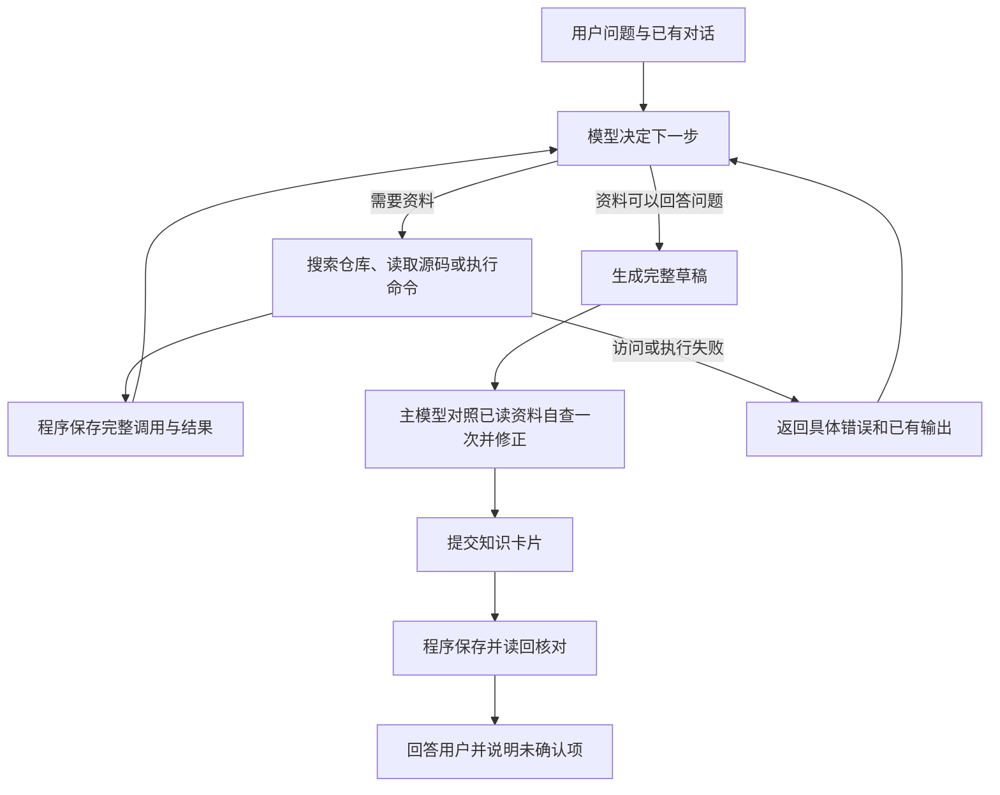

# PaperWiki：把研究结果变成可持续使用的知识库

**FastAPI · Vue 3 · SQLite · Markdown · 模型工具调用**

PaperWiki 是面向个人论文阅读与公开代码仓库研究的智能体。用户提出问题后，模型自行选择资料与工具；研究结果写成中文知识卡片，后续问答优先读取卡片。目标是让一次研究留下可以继续使用、修改和追溯版本的知识。

> 本文以当前代码为准，更新于 **2026-09-28**。旧复盘描述当时的实现，不代表今天仍启用那些机制。性能数据来自已归档的四仓库实验，**早于最后一次工具精简**，不是当前提交重新跑出的成绩。

## 导航

- [面试时怎样讲](#1-面试时怎样讲)
- [从用户请求到答案的完整链路](#2-从用户请求到答案的完整链路)
- [当前开放的七个工具](#3-当前开放的七个工具)
- [知识压缩为什么会失真，怎样改善](#4-知识压缩为什么会失真怎样改善)
- [运行记录、恢复与上下文管理](#5-运行记录恢复与上下文管理)
- [根据失败记录逐步修改了什么](#6-根据失败记录逐步修改了什么)
- [与 WorkBuddy 的对比](#7-与-workbuddy-的对比)
- [为什么更快，为什么费用下降](#8-为什么更快为什么费用下降)
- [工具与 MCP 的边界](#9-工具与-mcp-的边界)
- [安装、启动与测试](#10-安装启动与测试)
- [代码导航和当前边界](#11-代码导航和当前边界)

## 1. 面试时怎样讲

### 项目解决什么问题

论文阅读和代码研究会产生很多临时答案，但这些答案很难持续维护。我把研究结果保存成知识卡片，让后续问答直接使用经过整理的知识。核心困难是：**原始资料压缩成卡片时容易丢失条件，长任务又容易重复检索、盲目重试和中断丢进度。**

### 我实现了什么

我实现了一个单智能体执行循环：模型决定下一步，程序执行工具、保存调用与结果，再把结果交回模型。无依赖的只读调用可以并发，写入和存在依赖的调用按顺序执行。论文有专门的解析与入库流程，仓库研究支持定位版本、按文件读取和必要时检出源码。

写仓库卡片时，主模型先对完整草稿自查一次，再提交保存；后续回答以卡片为依据。程序负责格式、版本和保存结果等可以确定检查的事项，语义是否忠实仍需要模型判断。

### 我怎样迭代

我保留失败运行记录，核对工具参数、真实返回、模型用量和最终文件。例如，曾发现数字校验把列表编号和提交哈希误当实验数值；另一次，评审模型把输出额度全部用于思考，程序却把“没有完成评审”当成“证据不支持”。这些错误让主模型不断改写和重试。

后续取消了普通研究的逐工具充分度评估、仓库卡片的独立循环评审和固定检索次数上限，补全原始工具消息、错误反馈和保存回读。最后又精简工具，把 arXiv 的搜索、查详情、入库和查状态合并成一个入口。

### 已经证明什么，还有什么没证明

同一道四仓库研究题，最新归档实验完成 4/4 张卡片，用时约 9 分 19 秒；上一轮约 19 分钟。按同一组历史价格折算，费用从约 2.90 元降至 1.10 元。WorkBuddy 原测试约 27 分 36 秒、1.77 元，但关键事实抽查评分仍领先我们一些。

**这是一个具体任务上的工程改进证据，不能推广为所有研究任务都更快、更便宜或更准确。** 最后一次工具合并已通过定向测试，尚未重跑完整对照实验。

## 2. 从用户请求到答案的完整链路

### 2.1 普通知识问答

```text
用户提问
  → 模型读取问题、相关对话和知识目录
  → 按需打开知识卡片
  → 根据卡片回答；卡片没有记载的内容明确说明
```

普通问答不要求每次回到原论文，也不强制先创建研究计划。用户要求查原文、更新知识或开展新研究时，模型再调用相关工具。

### 2.2 多步研究与仓库卡片生成


```mermaid
flowchart TD
    A[用户问题与已有对话] --> B[模型决定下一步]
    B -->|需要资料| C[搜索仓库、读取源码或执行命令]
    C --> D[程序保存完整调用与结果]
    D --> B
    B -->|资料可以回答问题| E[生成完整草稿]
    E --> F[主模型对照已读资料自查一次并修正]
    F --> G[提交知识卡片]
    G --> H[程序保存并读回核对]
    H --> I[回答用户并说明未确认项]
    C -->|访问或执行失败| J[返回具体错误和已有输出]
    J --> B
```

- **搜索什么由模型决定。** 用户原问题、历史消息、已读材料和工具说明共同构成下一次输入，没有强制的独立“问题改写模型”。
- **什么时候结束由模型结合任务决定。** 研究并写入四篇，就需要逐篇检查保存回执；只研究其中两篇不能算完成四篇。
- **当前普通问答和复杂研究使用同一个执行循环。** 复杂度主要体现在模型选择的步骤与阅读深度。旧的“研究模式”参数仍为历史兼容保留，默认路径没有另接一套深度研究引擎。
- **当前不开放计划读写、记忆更新工具。** 模型可以在当前上下文中分解任务，不必每轮创建计划文件。旧计划与研究账本代码用于历史兼容，不能算成当前默认启用的能力。
- **默认没有固定研究调用次数上限。** 单次命令超时、模型上下文容量、仓库存储限制仍存在；用户也可以停止任务。这些限制与“最多搜索 64 次”不是同一种控制。

项目没有直接接入 Jina、LangGraph 或其他产品的研究执行框架；借鉴的是研究反馈和状态管理思路，执行循环由本项目实现。

### 2.3 论文入库有自己的处理链路

```text
用户给论文名字 / arXiv ID / 链接
  → 名字不明确时搜索候选，核对标题、作者与摘要
  → 提交论文入库，取得任务编号
  → 优先解析 arXiv HTML
  → HTML 不可用或结构质量不足时尝试 MinerU
  → MinerU 不可用或失败时降级到 PyMuPDF
  → 提炼论文知识、检查证据、判断与已有知识的关系
  → 按审批策略保存或生成修改提案
  → 查询任务状态，打开生成的知识卡片
```

HTML 的质量检查关注标题、正文长度、段落和章节结构等，不是论文结论正确性的判断。MinerU 使用外部解析服务，本项目负责提交、轮询、下载和转换结果；没有自行训练文档解析模型。降级解析可能损失复杂公式和表格结构。

**两条写入路径要区分：**仓库研究的 `wiki_write` 使用主模型一次自查；论文入库仍有专门的提炼、评审与合并流程。不能把“取消仓库卡片独立评审”说成整个项目没有论文评审。

## 3. 当前开放的七个工具

工具调用的意思是：模型输出工具名称和结构化参数，由 Python 校验并执行，结果作为工具消息交回模型。模型不会仅凭输出一段命令就自动完成执行。

接口以 [工具定义](system/wiki/agent_tools.py) 为准。下面的 JSON 展示名称与参数；实际模型接口还会附带调用编号等协议字段。

| 工具名称 | 中文作用 | 什么时候使用 |
|---|---|---|
| `local_shell` | 执行命令 | 文件处理、公开网页/API 访问、本地代码搜索和验证 |
| `repository` | 研究 GitHub 仓库 | 查候选仓库、固定版本、定位和读取源码、可选检出 |
| `wiki_write` | 保存仓库知识卡片 | 完稿并自查后提交，返回保存与读回结果 |
| `wiki_open` | 打开知识卡片 | 普通知识问答、读取已写入内容 |
| `evidence_lookup` | 查询保留的原文片段 | 明确要求回查论文等旧卡片来源时 |
| `read_tool_result` | 读取已保存的大结果 | 补读被省略的内容，不重复执行原工具 |
| `arxiv` | 搜索与导入论文 | 搜索、查元数据、入库、查询入库状态 |

当前模型没有独立的 `web_search`、`web_fetch` 工具。相关底层服务仍可能被后台维护功能使用，不代表模型能直接调用。网页查询可以通过命令访问搜索服务或公开 API，具体能力受网络和目标网站限制。

### 3.1 执行命令：local_shell

| 参数 | 类型及要求 | 含义 |
|---|---|---|
| `command` | 字符串，必填 | 实际执行的命令 |
| `cwd` | 字符串，可选 | 已存在的工作目录；省略时使用当前会话临时目录 |
| `shell` | `powershell / bash`，可选 | 命令语言，默认 PowerShell |
| `timeout_seconds` | 整数 1–300，可选 | 默认等待 120 秒 |

```json
{"name":"local_shell","arguments":{"command":"rg -n 'memory' ./src","timeout_seconds":60}}
```

返回标准输出、错误输出、退出码和是否超时。超时或非零退出不保证没有产生副作用；退出码为零也不保证命令内部每项下载都成功，模型仍应检查内容。

命令继承后端进程的系统权限，**不是隔离沙箱**。所有命令调用在调度层串行处理，不靠模型声称“只读”就并发执行。

### 3.2 研究仓库：repository

| 参数 | 类型及要求 | 含义 |
|---|---|---|
| `operation` | 枚举，必填 | 见下表 |
| `repository` | 字符串 | 已确认的 `owner/repo` 或仓库根 URL |
| `ref` | 字符串，可选 | 分支、标签或提交版本，打开时默认 HEAD |
| `snapshot_id` | 字符串 | 打开仓库后返回的快照编号 |
| `path` | 字符串 | 仓库内相对文件路径或目录前缀 |
| `query` | 字符串 | 发现仓库时的搜索词，或路径/正文的字面查询 |
| `paths` | 字符串数组，最多 8 个 | 已发现的文件路径，用于正文搜索 |
| `start_line / end_line` | 整数，最小 1 | 读取的行号范围 |
| `offset` | 非负整数 | 分页起点 |
| `limit` | 整数 1–100 | 返回规模，具体含义由操作决定 |

| 操作 | 主要输入 | 返回/作用 |
|---|---|---|
| `discover` | `query` | 候选仓库；仍需核对项目身份 |
| `open` | `repository`，可选 `ref` | 固定提交版本，取得快照编号 |
| `list` | `snapshot_id`，可选 `path` | 查看文件目录 |
| `search` | `snapshot_id, query` | 默认搜路径；指定 `paths` 时搜这些文件正文 |
| `read` | `snapshot_id, path` | 读取指定行范围的源码 |
| `checkout` | `snapshot_id` | 在容量限制内浅层检出源码，便于本地跨文件检索 |
| `cache_status` | 无额外必填项 | 查看缓存容量与使用情况 |

```json
{"name":"repository","arguments":{"operation":"open","repository":"ouchfys/LLM-WIKI"}}
```

默认按需读取文件，**不会每次自动克隆整个仓库**。遇到跨文件研究或 API 限流，模型可以选择检出。缓存占本地磁盘，受容量与过期策略管理。工具没有自动理解整个仓库、跨语言调用图或持续监控所有变更的能力。

### 3.3 保存卡片：wiki_write

| 参数 | 类型及要求 | 含义 |
|---|---|---|
| `title` | 字符串，必填 | 中文卡片标题 |
| `repository` | 字符串，必填 | 实际研究的 `owner/repo` |
| `topic` | 字符串，必填 | 稳定主题标识，用于识别同一项目文章 |
| `sections` | 数组，1–16 项，必填 | 最终完整章节 |
| `sections[].heading` | 字符串，必填 | 读者可见的章节标题 |
| `sections[].content` | 字符串，必填 | 章节正文，不重复标题 |
| `sections[].section_id` | 字符串，可选 | 修改已有局部章节时使用 |
| `commit` | 字符串，可选 | 实际观察到的仓库版本，未知就省略 |
| `revision_id` | 字符串，修改已有卡片时使用 | 防止覆盖他人已更新的版本 |
| `unknowns` | 字符串，可选 | 与用户问题相关、尚未确认的内容 |

```json
{
  "name": "wiki_write",
  "arguments": {
    "title": "示例项目的会话保存方式",
    "repository": "owner/repo",
    "topic": "memory-system",
    "sections": [
      {"heading": "对话保存在哪里？", "content": "这里填写经过原文核对的完整解释。"}
    ],
    "unknowns": "明确说明仍未确认的核心问题。"
  }
}
```

上例仅说明格式，不能用示例仓库或占位正文冒充真实产物。工具保存后读回 Markdown；重复提交相同已保存内容可以复用回执。**保存成功只证明写入成功，不证明事实全部正确。** 正文不要求放源码链接，来源仓库与已知版本由元数据保留。

### 3.4 打开卡片：wiki_open

| 参数 | 类型及要求 | 含义 |
|---|---|---|
| `card_ids` | 字符串数组，可选 | 来自知识目录或已观察结果的卡片编号 |
| `query` | 字符串，可选 | 没有明确编号时用于查找 |
| `limit` | 整数 1–8，可选 | 最多打开多少张卡片 |
| `refresh` | 布尔值，默认 false | 已读卡片是否需要重新读取 |
| `reason` | 字符串，刷新时必需 | 如卡片刚更新；不能笼统写“再确认一次” |

```json
{"name":"wiki_open","arguments":{"query":"会话压缩","limit":2}}
```

模型优先复用本轮已读内容；遗漏部分通过结果回读补齐。卡片正文不走普通工具的粗略预览裁剪，但仍受整个模型上下文容量约束。

### 3.5 查原文：evidence_lookup

| 参数 | 类型及要求 | 含义 |
|---|---|---|
| `query` | 字符串，必填 | 要查的事实或原文关键词 |
| `card_ids` | 字符串数组，可选 | 已打开卡片的编号 |
| `limit` | 整数 1–8，可选 | 返回片段数量 |

```json
{"name":"evidence_lookup","arguments":{"query":"实验条件","limit":3}}
```

适用于保留原文材料的论文等旧知识，不要求新仓库卡片绑定证据编号。匹配到了文字不等于结论成立；没有匹配到也不等于论文没有相关实验。普通卡片问答无需例行调用。

### 3.6 补读大结果：read_tool_result

| 参数 | 类型及要求 | 含义 |
|---|---|---|
| `result_id` | 整数，必填 | 本会话此前返回的结果编号 |
| `query` | 字符串，可选 | 字面搜索；继续分页时省略 |
| `offset` | 非负整数，可选 | 字符偏移，默认 0，续读使用返回的下一位置 |
| `max_chars` | 整数 256–24000，可选 | 每页字符数，默认 4000 |
| `card_id` | 字符串，可选 | 多卡片结果中选择目标卡片 |
| `section` | 字符串，可选 | 选择章节编号或完整标题 |

```json
{"name":"read_tool_result","arguments":{"result_id":123,"offset":0,"max_chars":8000}}
```

编号必须来自真实回执。读取保存结果不会重新访问 GitHub，也不会重新执行命令。这是有必要暴露给模型的按需读取能力；数据库自动保存本身则不是模型工具。

### 3.7 论文统一入口：arxiv

| 参数 | 类型及要求 | 含义 |
|---|---|---|
| `action` | `search / lookup / import / status`，必填 | 操作类型 |
| `query` | 字符串，search 必填 | 论文名、关键词或主题 |
| `arxiv_ids` | 字符串数组，1–20 个，lookup 必填 | 已知论文编号，批量查询元数据 |
| `arxiv_id` | 字符串，import 必填 | 已确认的单篇论文编号 |
| `job_id` | 字符串，status 必填 | 导入返回的任务编号 |
| `limit` | 整数 1–20，可选 | 搜索候选数量，默认 5 |
| `author` | 字符串，可选 | 作者筛选 |
| `categories` | 字符串数组，最多 8 个，可选 | 学科筛选 |
| `year_from / year_to` | 整数 1991–2100，可选 | 年份范围 |
| `approval_mode` | `risk / manual / auto`，可选 | 入库审批策略，默认 risk |

```json
{"name":"arxiv","arguments":{"action":"search","query":"RSIAgent","limit":5}}
```

用户说“把 RSIAgent 这篇论文入库”，模型先搜索、核对候选，再用返回的真实编号调用 import；随后用返回的任务编号查 status。用户不需要先手动找编号。若多个同名候选无法区分，再询问用户。

search、lookup、status 属于读取；import 属于写入。**查状态成功不等于入库成功**，还要看任务是否完成、是否失败或等待审批。底层有请求间隔和网络重试，模型无需自己用命令重复发请求。

全部工具的模式还接受兼容字段 `gap_id`、`query_purpose`，均为可选；当前研究不依赖它们建立强制问题账本。

## 4. 知识压缩为什么会失真，怎样改善

原文写“启用某个插件后可以保存长期记忆”，卡片压缩成“系统自动保存长期记忆”，就丢掉了生效条件。原文给出一个可配置参数，卡片写成“产品默认值”，也是失真。流畅、简短、有引用都不能单独证明正确。

当前仓库卡片在提交前要求主模型通读完整草稿一次，重点找：

1. 原文没有支持的事实、因果或保证。
2. 被丢掉的版本、开关、适用条件和例外。
3. 中文转述改变的否定、先后顺序、数量关系。
4. 用户明确问到、却没有回答的核心问题。
5. 正文、公式和例子之间的矛盾。

发现具体问题直接修改；证据不够就缩小结论范围或写明未知。不额外产出评审报告，不以“必须找出问题”为目标，不反复润色到无限循环。见 [完整写作与自查提示词](system/wiki/prompts/repository_card.md)。

这借鉴了代码审查的“指出有依据、可定位、有实际影响的问题”，但没有再启动独立评审智能体。自查能够改善质量，**不能保证主模型发现自己的全部错误**。未来问答依赖卡片，所以必要条件应留在卡片正文里，不能指望以后每次回查原文补救。

论文知识更新仍会召回相关结论，由模型判断补充、冲突或替代关系，再由程序校验结构、来源归属和合法写入范围。审批方式受策略控制；不能据此声称所有命令都无法绕开审批修改文件。

## 5. 运行记录、恢复与上下文管理

### 5.1 模型与程序怎样分工

| 模型负责 | 程序负责 |
|---|---|
| 判断问题需要哪些资料 | 提供工具定义，校验参数与执行结果 |
| 根据观察选择下一步 | 保存调用编号、原始参数、输出和状态 |
| 调整搜索词、改正错误命令 | 执行并发分组和依赖屏障 |
| 判断内容是否足以回答 | 返回错误，不把执行失败解释为事实不成立 |
| 生成并自查卡片 | 写入、版本冲突检查和保存回读 |
| 说明完成项与未知项 | 记录运行结束、失败、暂停或恢复信息 |

原生工具协议保留调用与结果的对应关系；必要时使用 JSON 路由回退。不能在重组上下文时只留下“文件内容”，却丢掉它来自哪条命令、哪个路径。

### 5.2 并发不是“所有读取永远一起执行”

无依赖的只读工具最多三个并发，结果按模型原始调用顺序汇总。写操作和存在依赖的操作形成执行边界。例如，先发现论文编号，再提交入库，不能把两个步骤同时执行。

单次写调用串行，不代表后台所有入库任务只能一个一个跑；后台任务有独立的工作线程配置。`repository` 的缓存写入属于工具内部管理行为，不能把“研究只读”理解为磁盘绝不发生写入。

### 5.3 旧介绍里的几个名词是什么意思

| 名词 | 在本项目里的实际含义 | 不能夸大的地方 |
|---|---|---|
| 状态机 | 记录任务正在执行、等待、完成、失败等状态，并约束迁移 | 回合结束不等于用户所有要求都已完成 |
| 检查点 | 保存请求、调用与已返回结果，让恢复时重建上下文 | 不恢复 Python 调用栈，模型下一步可能变化 |
| 执行租约 | 给一个执行者暂时的任务持有权 | 用于减少多个执行者同时接管 |
| 心跳 | 执行者定期续约，表明仍在工作 | 不证明业务产生了有效进展 |
| 幂等提交 | 同一导入调用或相同已提交内容尽量复用已有结果 | 不能保证任意 Shell 命令自动只执行一次 |

浏览器断开与主动停止是不同事件。服务重启后，可依据持久记录恢复执行；对于执行已开始、结果却未记录的写操作，需要确认实际效果，不能盲目重放。见 [会话恢复](system/agent_runtime/chat_recovery.py)。

### 5.4 完整记录与模型上下文分开

- 完整工具结果保存到 SQLite。大结果交给模型时提供预览、结果编号与补读方式。
- 上下文按 token 预算组织，不是把数据库所有历史无限塞给模型。
- 默认压缩触发配置为窗口的 80%，近期保留配置为窗口的 16%；实际保留量还受其他上下文和摘要预算限制。
- 旧历史生成摘要，近期交互按顺序保留，并保护工具调用与结果配对。
- 普通长工具预览可保留头尾并标明省略，完整结果仍可回读；知识卡片正文有专门的处理路径。
- 压缩摘要帮助继续当前任务，不自动等于可靠的跨会话长期知识。

这些预算保护单次模型请求容量，不是重新加入研究调用次数额度。

### 5.5 代码目录与数据目录分开

默认数据根目录为用户主目录下的 `.paperwiki`。设置 `PAPERWIKI_HOME` 可以改到测试目录，指定目录本身就是数据根，不再额外套一层。

```text
~/.paperwiki/
├── sessions/       会话数据库、任务与工具结果
├── wiki/           生成的 Markdown 知识
├── sources/        论文原件与解析材料
├── memory/         已有项目记忆和兼容数据
├── cache/repos/    仓库缓存
├── tmp/            按会话使用的临时文件
├── projects/       用户明确要求的项目产物
├── archives/       归档的实验与复盘
└── logs/           运行日志
```

目录按需使用，不要求每次对话都创建一个计划文件夹。命令的默认工作目录放在会话临时目录，但显式绝对路径仍可以写到其他位置；这是一条存储约定，不是权限隔离。

## 6. 根据失败记录逐步修改了什么

| 阶段 | 观察到的失败 | 查明的原因 | 后续调整 |
|---|---|---|---|
| 反复查证阶段 | 简单定义问题不断重读相同资料 | 缺少有效的结束判断；重复工具结果没改变结论 | 提示复用已读内容、区分普通问答与主动研究；之后撤回过度机械的充分度门槛 |
| 9 月 26 日，交付 1/4 | 61 次工具，10 次失败，其中 8 次写入被拒 | 数字规则误查列表编号、提交哈希、源码行号；只返回笼统拒绝 | 语义数字核对交给模型；返回可定位的真实错误，避免盲改整篇 |
| 9 月 27 日，未写入 | 28 次工具、5 次失败；12 次充分度评估消耗约 27.6 万 token | 工具结果丢命令与路径，评估器误认未读；局部停滞终止整个多项目任务 | 保留原始调用关系，移除逐工具充分度评估，允许其他项目继续，提供思考强度选择 |
| 后续评审阶段，交付 2/4 | 8 次评审无正文，约耗 9 分 21 秒；检索额度用尽 | 每次 16000 输出 token 全用于思考；评审未完成被当成证据不支持；补读使已通过缓存失效 | 最终改成仓库卡片一次主模型自查；取消独立循环评审与固定检索次数限制 |
| 9 月 28 日，上轮交付 4/4 | 能完成，但耗时约 19 分钟 | 决策轮数、累计输入和思考输出仍多 | 持续调整资料读取、提示词、消息保留和直接保存流程 |
| 9 月 28 日，最新归档交付 4/4 | 9 分 19 秒，四篇均一次提交并读回 | 不再出现写入评审重试；仍有 GitHub 限流和大仓库检出失败 | 记录效率收益，同时保留事实覆盖缺口 |
| 当前工具精简 | 工具说明仍包含历史计划与多个论文入口 | 老能力留在默认接口中，增加使用与维护负担 | 默认七工具；四个 arXiv 动作统一入口；删除未使用的 MCP 服务封装 |

这条演进路径包含撤回不合适的设计：曾尝试让宿主逐次判断证据是否足够，实际引入了额外调用和误判，随后把研究判断交回主模型。**并不是校验越多越可靠；需要把可以确定检查的结构问题与需要上下文判断的语义问题分开。**

原始问题与定位见：

- [9 月 26 日：数字误判与错误反馈缺失](docs/audits/TRACE_FAILURE_REPOSITORY_MEMORY_2026-09-26.md)
- [9 月 27 日：消息丢失、提前结束与思考配置](docs/audits/TRACE_FAILURE_REPOSITORY_MEMORY_2026-09-27.md)
- [9 月 27 日：评审截断与预算耗尽](docs/audits/TRACE_FAILURE_REPOSITORY_MEMORY_2026-09-27_REVIEW_BUDGET.md)
- [9 月 28 日：公开对照摘要与统计口径](docs/audits/COMPARISON_PUBLIC_2026-09-28.md)

旧报告里的本机原始证据位置仅用于当时审计，公开仓库不包含私人会话数据库和完整原始运行记录。

## 7. 与 WorkBuddy 的对比

### 7.1 比较任务

两边研究 DeepSeek Harness、Codex CLI、Pi、Hermes 的记忆系统，分别生成四篇知识卡片，回答：

1. 对话保存在哪里，模型每次读取哪部分，近期内容按消息条数还是 token 选择？
2. 上下文压缩如何触发、提示词要求保留什么、摘要落盘还是进入上下文？
3. 长期记忆维护什么？
4. 用一个连续例子串起机制。

WorkBuddy 也获得了写作参考。两边系统提示、工具与服务配置不完全相同，部分仓库版本不同；WorkBuddy 没有随每次 PaperWiki 改动重跑。因此这是**任务案例对照**，不是严格控制变量的框架排名。

### 7.2 实测用量

| 指标 | 上轮 PaperWiki | 最新归档 PaperWiki | WorkBuddy 原测试 |
|---|---:|---:|---:|
| 完成卡片 | 4/4 | 4/4 | 4/4，另有 4 份证据文件 |
| 用时 | 19 分 00.845 秒 | **9 分 19.006 秒** | 27 分 36.455 秒 |
| 模型调用次数 | 55 | **24**，含 1 次标题生成 | 110 |
| 工具调用次数 | 161 | 138 | 132 |
| 累计输入 token | 7,257,375 | 2,648,736 | 18,187,080 |
| 其中缓存命中 | 6,786,688 | 2,453,888 | 17,994,624 |
| 其中缓存未命中 | 470,687 | 194,848 | 192,456 |
| 输出 token | 210,505 | 77,070 | 82,857 |
| 输出中包含的思考 token | 164,762 | 48,250 | 28,470 |
| 历史固定价格折算 | ¥2.8969 | **¥1.1044** | ¥1.7676 |

价格口径为每百万 token：缓存命中输入 ¥0.04、未命中输入 ¥2、输出 ¥8。**这是统一价格折算，不是当前报价，也不是 WorkBuddy 实际套餐账单。** 思考 token 已包含在输出中，不重复计费。

累计输入多次包含已有历史，不代表读到了同等数量的独立资料，也不能据此判断单次上下文溢出。

### 7.3 两边实际调用了什么

| 最新归档 PaperWiki | 次数 | WorkBuddy | 次数 |
|---|---:|---|---:|
| 仓库工具 | 124 | Bash 命令 | 98 |
| Shell 命令 | 6 | Read 文件读取 | 8 |
| 计划更新，现已移除 | 3 | Write 文件写入 | 9 |
| Wiki 写入 | 4 | Edit 文件修改 | 12 |
| 记忆更新，现已移除 | 1 | WebSearch 网页搜索 | 3 |
| — | — | TaskCreate 任务创建 | 1 |
| — | — | present_files 展示文件 | 1 |
| **合计** | **138** | **合计** | **132** |

PaperWiki 的仓库操作包括：发现 4 次、打开 4 次、列目录 27 次、搜索 40 次、读文件 48 次、检出 1 次。WorkBuddy 主要先把仓库克隆到本地，再用命令搜索与读取。

工具次数并没有比 WorkBuddy 少。差异在于读取策略、每轮工具批量、模型往返次数、产物范围和上下文使用；不能只看“工具数量”评价效率。

### 7.4 产物质量

人工按事实准确性 40、问题覆盖 30、可读性 20、追溯 10 分抽查关键结论：

| 卡片 | 最新归档 PaperWiki | WorkBuddy |
|---|---:|---:|
| Pi | 87 | 90 |
| DeepSeek Harness | 82 | 86 |
| Codex CLI | 77 | 82 |
| Hermes | 74 | 82 |
| **平均** | **80** | **85** |

这是带主观判断的编辑评分，不是全量事实准确率，也不是独立评测榜单。WorkBuddy 产物同样有错误，不能把它当标准答案。

PaperWiki 的四篇可见正文约 1.13 万字符，WorkBuddy 约 2.46 万字符。我们的结构更统一、适合快速查阅，但也漏掉了应当回答的内容：

- 把底层组件“路径参数必填”当成产品没有默认会话目录，没有继续追基础配置。
- 把某条压缩路径的规则泛化到整个产品，遗漏不同供应商或模式的条件。
- 介绍长期记忆时只给文件名，没充分解释默认位置、维护内容和启用条件。
- 最终跨项目汇总新增了卡片未证明的统一执行顺序。

所以当前结论是：**交付效率明显改善，事实覆盖仍需继续提高。** 正确方向是追清默认装配、调用者与条件，并在一次完稿自查中发现具体问题；尚无证据支持重新增加每步评估或多轮评审。

## 8. 为什么更快，为什么费用下降

### 8.1 可以从记录中直接看到的变化

1. **模型往返减少。** 最新 PaperWiki 主循环 23 轮，常在一轮提出多个独立工具调用；总模型调用 24 次，WorkBuddy 为 110 次。
2. **最新运行没有写入评审重试。** 四次卡片提交都成功，避免了旧流程反复评审、失败、改稿、再评审的开销。
3. **比上一轮思考输出明显减少。** 思考 token 从 164,762 降到 48,250；输出通常比缓存命中输入更贵。
4. **累计输入减少。** 比上一轮少了许多历史重复送入模型的量，但这不等于所有读取内容都减少了相同比例。
5. **交付范围不同。** WorkBuddy 正文更长，还生成独立证据文件；这也是理解成本差异时需要考虑的因素。

最新一轮仍发生四次 GitHub 429，以及一次大仓库检出容量失败。它不是“没有错误所以更快”，而是在错误后继续完成了可交付内容。

### 8.2 费用不能直接按总 token 比例比较

最新 PaperWiki：

```text
2.453888 × 0.04   缓存命中输入
+ 0.194848 × 2    新输入
+ 0.077070 × 8    输出，已含思考
= 1.10441152 元
```

相比 WorkBuddy，累计 token 约少 **85.08%**，固定价格折算只少 **37.52%**。原因是 WorkBuddy 很多输入命中缓存，两边未命中的输入数量几乎相同。相比上轮 PaperWiki，用时少约 **51.00%**，折算费用少约 **61.88%**。

并发工具的执行时长也不能直接相加当总耗时；应计算真实开始到结束时间，或并行执行区间的并集。

### 8.3 哪些只能作为解释，不能声称已经证明

上述数据支持“这一轮调用结构和用量更省”。但多项代码、提示词、阅读范围与环境同时改变，没有做逐项消融实验，不能宣称某一行提示词贡献了全部收益。

删除 MCP 包装、合并工具入口主要减少接口与维护负担；**工具更少不自动等于模型调用更少**。当前七工具版本还需同题重跑，才能测量最后这轮精简的实际影响。

## 9. 工具与 MCP 的边界

**工具**定义模型能做什么，包括名称、参数和返回值；**MCP** 是把这些能力提供给不同客户端的一种连接协议。一个 MCP 服务可以暴露多个工具，模型最终仍需要理解工具参数。

原 arXiv MCP 包装没有成为当前聊天主循环的必经路径。业务本来就在 Python 服务内部，再维护一个独立包装需要额外处理进程启动、配置、协议和测试。本次移除包装，保留论文服务，把四种动作合并成 `arxiv`。

| 情况 | 选择 |
|---|---|
| 只有 PaperWiki 内部使用论文搜索与入库 | 直接调用内部服务，再提供统一工具 |
| 希望多个独立客户端复用同一能力 | 可以增加 MCP 适配层，共享业务实现 |
| 要独立部署、由外部团队管理服务 | 评估 MCP 与鉴权、部署、版本兼容的配合 |
| 只想让工具列表少几个名字 | 不需要因此引入 MCP；调整工具接口即可 |

面试可这样说：

> 我们删除的是没有实际进入主链路的协议包装，没有删除论文检索与入库能力。工具定义业务动作，MCP 解决跨客户端连接问题；只有存在这个复用需求时，额外协议层才有明确价值。

详见 [工具与 MCP 边界案例](docs/design/TOOL_MCP_BOUNDARY_CASE.md)。

## 10. 安装、启动与测试

### 10.1 从源码运行

需要 Python 3.10 或以上、Node.js/npm；研究命令需对应的 PowerShell 或 Bash，仓库检出需 Git。

```powershell
git clone https://github.com/ouchfys/LLM-WIKI.git
cd LLM-WIKI
python -m venv .venv
.\.venv\Scripts\Activate.ps1
python -m pip install -e .
Copy-Item .env.example .env
```

编辑 `.env` 后启动：

```powershell
paperwiki web
```

启动器会按需安装前端依赖和构建页面，默认监听 `127.0.0.1:8000`。源代码留在安装目录，运行数据放到数据根目录。

| 配置 | 用途 |
|---|---|
| `DEEPSEEK_API_KEY / DEEPSEEK_BASE_URL / DEEPSEEK_CHAT_MODEL` | 研究模型连接 |
| `PAPERWIKI_THINKING_EFFORT` | 默认思考档位：none、low、high、max；界面可覆盖 |
| `BAILIAN_API_KEY` | 可选语义向量服务；不使用时关闭向量检索配置 |
| `WIKI_VECTOR_SEARCH_ENABLED` | 是否使用语义检索，配合关键词检索与融合排序 |
| `MINERU_API_TOKEN` | PDF 精细解析服务凭据 |
| `GITHUB_TOKEN` | 可选 GitHub 访问凭据，提升认证访问可用性 |
| `PAPERWIKI_HOME` | 数据根目录 |
| `LLM_WIKI_API_URL` | 论文服务调用本地入库接口的地址 |

不把 `.env`、访问凭据或私人数据库提交到 Git。GitHub 凭据需由后端配置，其他客户端的登录状态不会自动传给 PaperWiki。配置凭据也不保证免于所有访问限制。

使用独立测试目录：

```powershell
$env:PAPERWIKI_HOME = "$env:USERPROFILE\Desktop\paper wiki测试"
paperwiki web
```

端口被占用时，确认原服务是否仍在运行；需要另开端口则同步修改入库接口地址：

```powershell
$env:LLM_WIKI_API_URL = "http://127.0.0.1:8001"
paperwiki web --port 8001
```

### 10.2 验收方式

先执行定向自动测试，覆盖工具参数、读写调度、导入等待、会话恢复、数据目录、仓库保存等行为：

```powershell
python -m pytest test/wiki/test_unified_arxiv_tool.py test/wiki/test_agent_tool_contracts.py test/wiki/test_ingestion_wait_runtime.py test/discovery/test_arxiv_service.py test/agent_runtime/test_chat_recovery.py test/wiki/test_unified_agent_loop.py test/storage -q
cd frontend
node --test tests/*.test.mjs
npm run build
```

模型与网络夹具测试能够验证程序行为，不能替代真实卡片质量检查。完整人工验收使用第 7 节四仓库问题，记录：

- 四篇是否全部保存且能够读回。
- 用户明确问题是否逐项回答，关键事实是否有原文依据。
- 模型/工具调用、累计输入、缓存命中、新输入、输出和耗时。
- 失败的真实原因、恢复动作以及重复尝试。
- 卡片中的具体误述与遗漏，不只评判排版是否好看。

旧版本“30 题检索评测”“140 条证据判定评测”不能作为当前七工具研究流程的准确率。最近验证范围和公开统计见 [对照报告](docs/audits/COMPARISON_PUBLIC_2026-09-28.md)。

## 11. 代码导航和当前边界

| 文件或目录 | 中文说明 |
|---|---|
| [backend/cli.py](backend/cli.py) | 本地启动、前端构建和端口检查 |
| [system/wiki/wiki_chat.py](system/wiki/wiki_chat.py) | 模型决策、工具调度、观察反馈与答案 |
| [system/wiki/agent_tools.py](system/wiki/agent_tools.py) | 当前七个工具的统一参数定义 |
| [system/agent_runtime/tool_operations.py](system/agent_runtime/tool_operations.py) | arXiv 动作分类与历史调用兼容 |
| [system/agent_runtime/repositories.py](system/agent_runtime/repositories.py) | GitHub 访问、版本快照、源码缓存 |
| [system/wiki/repository_writer.py](system/wiki/repository_writer.py) | 仓库卡片保存与读回 |
| [system/wiki/prompts/repository_card.md](system/wiki/prompts/repository_card.md) | 中文写作、自查要求及示例 |
| [system/discovery/arxiv_service.py](system/discovery/arxiv_service.py) | 论文搜索、元数据、下载与导入服务 |
| [system/document/parser_router.py](system/document/parser_router.py) | HTML、MinerU 与降级解析选择 |
| [system/wiki/paper_pipeline](system/wiki/paper_pipeline) | 论文提炼、评审与知识合并 |
| [system/agent_runtime/chat_recovery.py](system/agent_runtime/chat_recovery.py) | 会话恢复与未知执行结果处理 |
| [system/conversation](system/conversation) | 原生消息、上下文预算、压缩与结果回读 |
| [system/storage/layout.py](system/storage/layout.py) | 与源码目录分离的数据布局 |
| [frontend/src/components/AgentActivity.vue](frontend/src/components/AgentActivity.vue) | 工具参数、结果、失败和耗时展示 |

当前应继续解决的主要问题：

- 研究质量：沿入口和调用者查默认配置，避免只看组件定义就下结论。
- 网络与缓存：大仓库和限流仍会增加等待；本地检出策略需要结合任务与容量选择。
- 成本验证：用同样的模型、材料范围与配置重复运行，验证最新接口精简的影响。
- 安全隔离：Shell 拥有后端进程权限；面向不可信用户部署前需要真正的权限边界。
- 工程整理：保留了历史研究协议与兼容代码，后续按真实使用情况逐步清理。

完整专项文档见 [文档索引](docs/README.md)。
